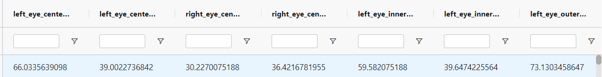

The link to the Facial keypoints dataset:-

https://dagshub.com/Ln11211/facial-keypoint-detection

**Description**:
Each keypoint is specified by an (x,y) real-valued pair in the space of pixel indices. There are 15 keypoints, which represent the following elements of the face:

left_eye_center, right_eye_center, left_eye_inner_corner, left_eye_outer_corner, right_eye_inner_corner, right_eye_outer_corner, left_eyebrow_inner_end, left_eyebrow_outer_end, right_eyebrow_inner_end, right_eyebrow_outer_end, nose_tip, mouth_left_corner, mouth_right_corner, mouth_center_top_lip, mouth_center_bottom_lip

Left and right here refer to the point of view of the subject.

The link between the CSV and the images is the index. To find out the corresponding image for a record in training.csv, search for index.jpg in the training folder. 

**Citation**: 
Nagasai Biginepalli https://www.kaggle.com/nagasai524

**Prerequisite**: 
Knowledge of machine learning algorithms and techniques would be beneficial for using this dataset.

**License**: 
CC0: Public Domain