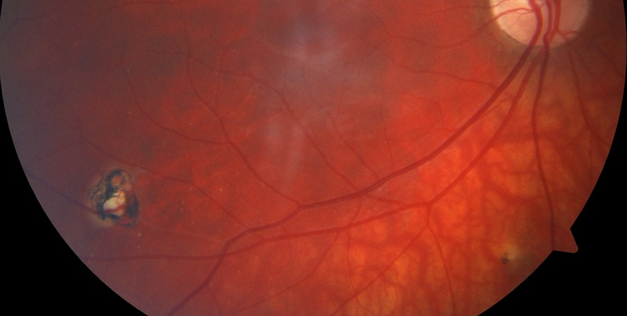

The link to the dataset:-

https://dagshub.com/Ln11211/ocular-toxoplasmosis-fundus-images-dataset

# **Description**:
**Raw Images**
The folder named "Data_Raw_6class_All" contains the original fundus images captured at 2 hospital centers:

Hospital de Clínicas Medical Center: The period of time consumed to collect the fundus images was from 2018 to 2020. The dataset consists of 291 fundus images with a size of 2124 x 2056 pixels in JPG format.
2.Niños de Acosta Ñú General Pediatric Hospital: Images were acquired in children under 18 years of age. The images were captured in the year 2021. The dataset consists of 121 fundus images with a size of 1536 x 1152 pixels in JPG format.

The images correspond to patients with suspected congenital toxoplasmosis infection. The fundus images are classified according to the following categories: Healthy and Diseased. Diseased in turn, can be classified into: i) Inactive only, ii) Active only and iii) Active/Inactive.

**Processed Images**
The folder named "Data_Processed_Paper" contains the processed images divided into only Healthy and Diseased Classes so that a binary classification can be performed. The "Diseased" class is formed by combining the 5 sub-divisions under it. After going through literature and rigorous benchmarking experimentation, Alam et al. has established a preprocessing pipeline that yields the best classification results. The preprocessing includes denoising/smoothening, normalization, contrast enhancement, illumination equalization, color space transformation etc.

**Citation**:
Cardozo, O., Ojeda, V., Parra, R., Mello-Román, J. C., Noguera, J. L. V., García-Torres, M. et al. (2023). Dataset of fundus images for the diagnosis of ocular toxoplasmosis. Data in Brief, 48, 109056.

Alam, S. S., Shuvo, S. B., Ali, S. N., Ahmed, F., Chakma, A., & Jang, Y. M. (2023). Benchmarking Deep Learning Frameworks for Automated Diagnosis of Ocular Toxoplasmosis: A Comprehensive Approach to Classification and Segmentation. arXiv preprint arXiv:2305.10975.

# **Prerequisite**:
Knowledge of Deep learning algorithms and techniques would be beneficial for using this dataset.

# **License**:
Attribution 4.0 International (CC BY 4.0)
